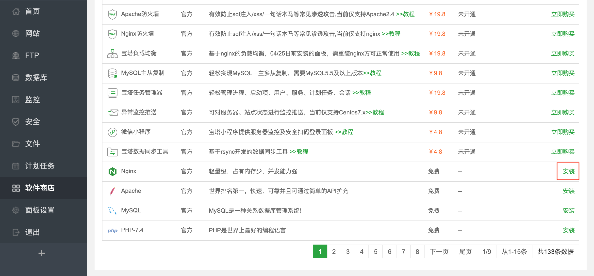

这篇文章主要是记录一下在vps服务器上配置v2ray，达到在国内访问google的目的


# 准备条件

首先需要一台国外的可用的VPS，我这边用的是vultr，选择的是日本的节点，如果还没有vps的话，可以通过我的[推广链接][1]注册一下，非常感谢！


# v2ray服务端环境配置

## 安装宝塔面板


Bt-Panel: http://202.182.107.83:8888/45281449
username: ccreczi0
password: ea048fc6

## 安装nginx

在宝塔界面的软件商店中选择安装nginx，点击安装，并在弹出的对话框中选择`极速安装`



添加站点


## 安装v2ray

PORT:24005
UUID:ef39641f-2057-495c-bb14-fff3ad18e8b5

## 配置SSL

```
    location /cs
    {
        proxy_pass http://127.0.0.1:24005;
        proxy_redirect off;
        proxy_http_version 1.1;
        proxy_set_header Upgrade $http_upgrade;
        proxy_set_header Connection "upgrade";
        proxy_set_header Host $http_host;
        proxy_read_timeout 300s;
    }
```

## 修改配置文件

```
{
  "policy": {
    "levels": {
      "0": {
        "uplinkOnly": 0,
        "downlinkOnly": 0,
        "connIdle": 150,
        "handshake": 4
      }
    }
  },
  "inbound": {
    "listen": "127.0.0.1",
    "port": 24005,
    "protocol": "vmess",
    "settings": {
      "clients": [
        {
          "id": "ef39641f-2057-495c-bb14-fff3ad18e8b5",
          "level": 1,
          "alterId": 32
        }
      ]
    },
    "streamSettings": {
      "network": "ws",
      "security": "auto",
      "wsSettings": {
        "path": "/cs",
        "headers": {
          "Host": "v2ray.xmalloc.club"
        }
      }
    }
  },
  "outbound": {
    "protocol": "freedom",
    "settings": { }
  },
  "outboundDetour": [
    {
      "protocol": "blackhole",
      "settings": { },
      "tag": "blocked"
    }
  ],
  "routing": {
    "strategy": "rules",
    "settings": {
      "rules": [
        {
          "type": "field",
          "ip": [
            "0.0.0.0/8",
            "10.0.0.0/8",
            "100.64.0.0/10",
            "127.0.0.0/8",
            "169.254.0.0/16",
            "172.16.0.0/12",
            "192.0.0.0/24",
            "192.0.2.0/24",
            "192.168.0.0/16",
            "198.18.0.0/15",
            "198.51.100.0/24",
            "203.0.113.0/24",
            "::1/128",
            "fc00::/7",
            "fe80::/10"
          ],
          "outboundTag": "blocked"
        }
      ]
    }
  }
}
```


## v2ray服务管理

# v2ray客户端设置

# BBR加速

[1]:https://www.vultr.com/?ref=8457221