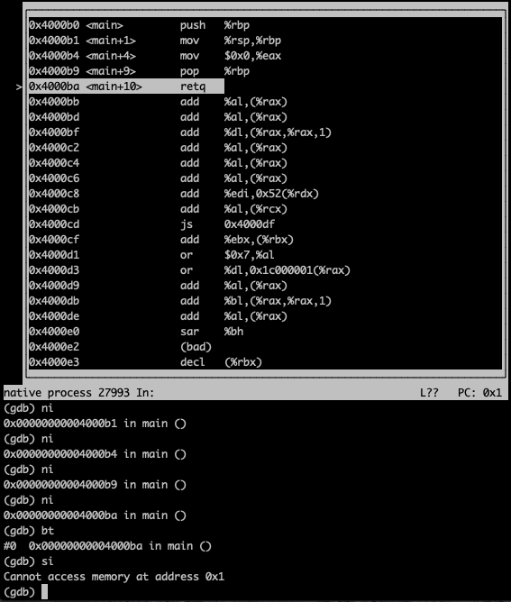

## 系统中常见应用程序

- Coreutilities, busybox
- 系统/工具程序：bash,apt,ip,ssh,vim....
- Others

## ELF文件

```
man readelf
```

```
root@ecs-x-medium-2-linux-20200301115117:~# readelf -l /bin/ls

Elf file type is DYN (Shared object file)
Entry point 0x5850
There are 9 program headers, starting at offset 64

Program Headers:
  Type           Offset             VirtAddr           PhysAddr
                 FileSiz            MemSiz              Flags  Align
  PHDR           0x0000000000000040 0x0000000000000040 0x0000000000000040
                 0x00000000000001f8 0x00000000000001f8  R E    0x8
  INTERP         0x0000000000000238 0x0000000000000238 0x0000000000000238
                 0x000000000000001c 0x000000000000001c  R      0x1
      [Requesting program interpreter: /lib64/ld-linux-x86-64.so.2]
  LOAD           0x0000000000000000 0x0000000000000000 0x0000000000000000
                 0x000000000001e6e8 0x000000000001e6e8  R E    0x200000
  LOAD           0x000000000001eff0 0x000000000021eff0 0x000000000021eff0
                 0x0000000000001278 0x0000000000002570  RW     0x200000
  DYNAMIC        0x000000000001fa38 0x000000000021fa38 0x000000000021fa38
                 0x0000000000000200 0x0000000000000200  RW     0x8
  NOTE           0x0000000000000254 0x0000000000000254 0x0000000000000254
                 0x0000000000000044 0x0000000000000044  R      0x4
  GNU_EH_FRAME   0x000000000001b1a0 0x000000000001b1a0 0x000000000001b1a0
                 0x0000000000000884 0x0000000000000884  R      0x4
  GNU_STACK      0x0000000000000000 0x0000000000000000 0x0000000000000000
                 0x0000000000000000 0x0000000000000000  RW     0x10
  GNU_RELRO      0x000000000001eff0 0x000000000021eff0 0x000000000021eff0
                 0x0000000000001010 0x0000000000001010  R      0x1

```

```
root@ecs-x-medium-2-linux-20200301115117:~# file /bin/ls
/bin/ls: ELF 64-bit LSB shared object, x86-64, version 1 (SYSV), dynamically linked, interpreter /lib64/l, for GNU/Linux 3.2.0, BuildID[sha1]=9567f9a28e66f4d7ec4baf31cfbf68d0410f0ae6, stripped
```

通过readelf查看ls二进制文件时，第15行LOAD的值都是0，因为linux开启了ASLR，同时ls二进制文件是一个位置无关（pIc）的代码，可以加载到内存的任意位置

## 应用程序怎么调用操作系统

### 失败的尝试1

hello.c

```c
#include <stdio.h>
int main() {
        printf("Hello World!\n");
}
```

```shell
root@ecs-x-medium-2-linux-20200301115117:~/test# gcc -c hello.c
root@ecs-x-medium-2-linux-20200301115117:~/test# ld hello.o
ld: warning: cannot find entry symbol _start; defaulting to 00000000004000b0
hello.o: In function `main':
hello.c:(.text+0xc): undefined reference to `puts'
```

Tips

- gcc -c 编译成目标文件
- ld xx.o 链接成可执行文件

**一些问题**

Q1: 第5行中为什么是puts，不是printf？

A1: gcc在 -O0的选项下依然会进行一定程度的编译优化，是导致一些编译器bugs的源头 [Automatic Self-Validation for Coverage Profilers]


Q2: undefined reference to `puts'

A2：puts是libc库函数中的函数，如果把库链接进来，就不满足“最小”应用程序的了，该方案应该被废弃


Q3: cannot find entry symbol _start

A3: _start是链接器默认的入口，可以通过-e，例 -e main来指定，这样就不会打印告警信息了

### 失败的尝试2

```c
int main() {
}
```

```shell
root@ecs-x-medium-2-linux-20200301115117:~/test# gcc -c hello1.c
root@ecs-x-medium-2-linux-20200301115117:~/test# ld -e main hello
hello.c   hello.o   hello1.c  hello1.o
root@ecs-x-medium-2-linux-20200301115117:~/test# ld -e main hello1.o
root@ecs-x-medium-2-linux-20200301115117:~/test# ./a.out
Segmentation fault (core dumped)
```

**问题**

为什么会发生段错误？



### 从失败的尝试中的总结

操作系统做了什么？

- 加载程序，并初始化运行环境
- 从_start开始执行

### 成功的尝试

minimal.S

用汇编调用SYSCALL  write

